# DevOps 06 Quality

## Lernjournal

Um Woche 6 zu erledigen, wurde der Stand von Woche 3 in dieses Repo kopiert.

### Lint-Warnung anhand HTML-Beispiel erzeugt, wieder behoben und dokumentiert

Fehler wurden für die Lint-Behandlung ergänzt. Die Vermerke im abgebildeten HTML zeigt, was verändert wurde und hoffentlich durch Lint erkennt wird:

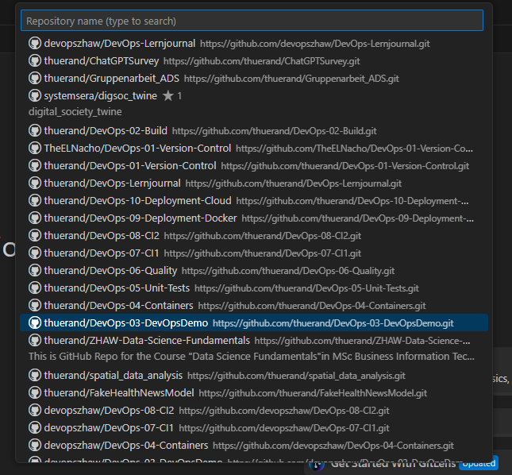

Um nun Lint starten zu können wurde der Folder "frontend" als Workspace geöffnet

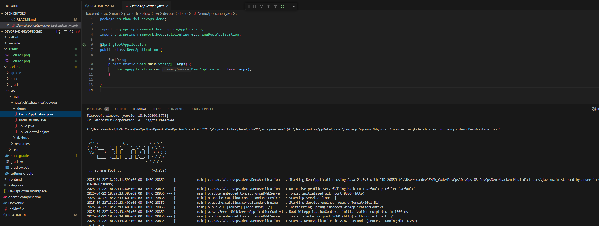

und Lint laufen gelassen:

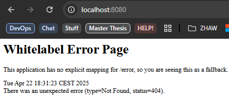

und wir sehen folgendes:
- L2 - lang wurde glöscht --> nicht entdeckt
- L7 - 
 wurde nicht geschlossen --> wurde entdeckt, aber in Line 12 vermerkt
- L10 - </link> wurde hinzugefügt --> wurde entdeckt
- L15 - angeblich falsche Selbstschliessung --> nicht entdeckt
- L31 - src gross geschrieben --> wurde entdeckt

Danach wurde das HTML korrigiert

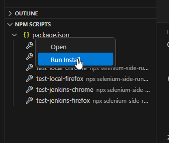

und nochmals ausgeführt:

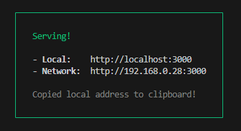

### Sonar Report für eigenes DevOpsDemo-Projekt erstellen und dokumentieren (Backend und Frontend)

Zuerst wird mal SonarQube in Docker gestartet:

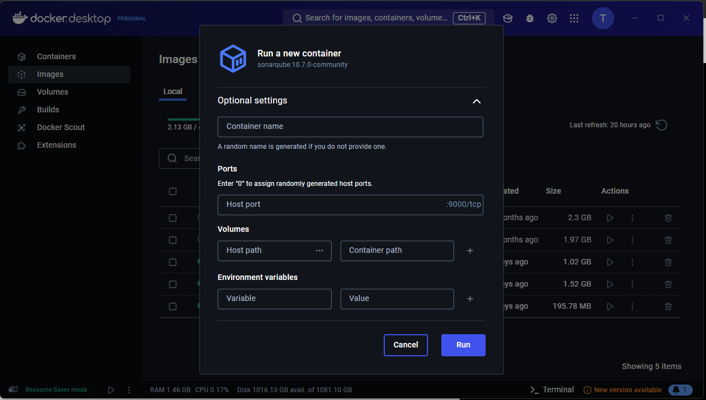

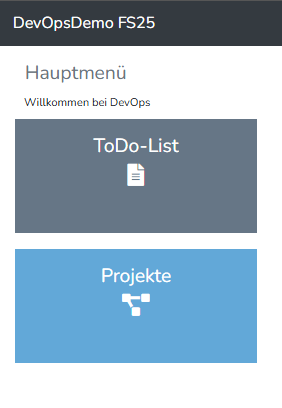

und SonarQube im Browser ersichtlich:

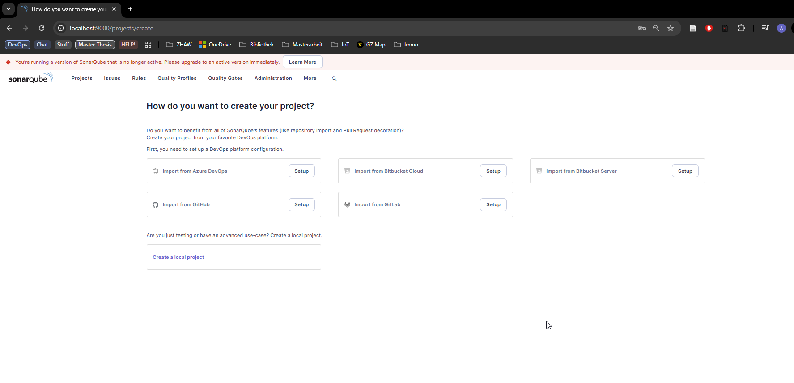

#### Backend:

Nun wird das Backend erstellt mittels local Project:

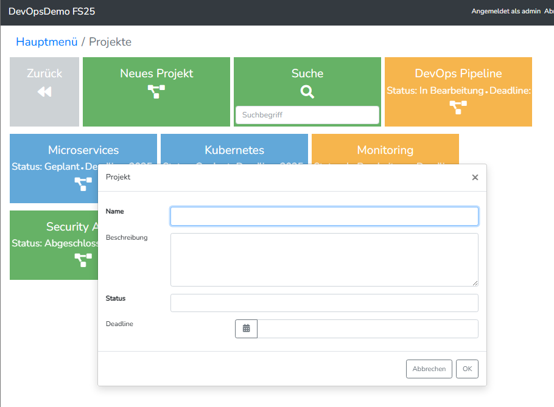

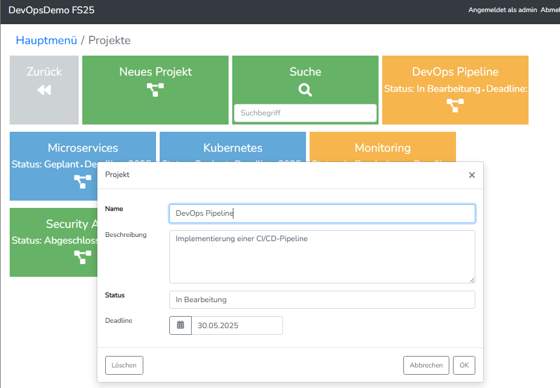

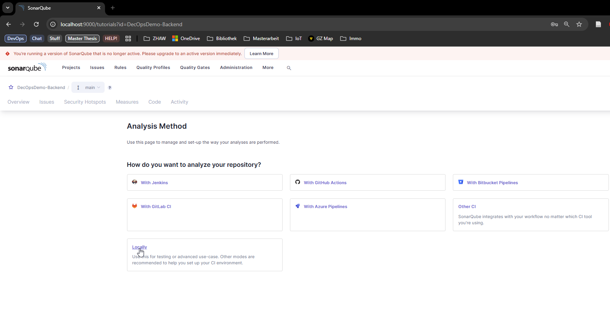

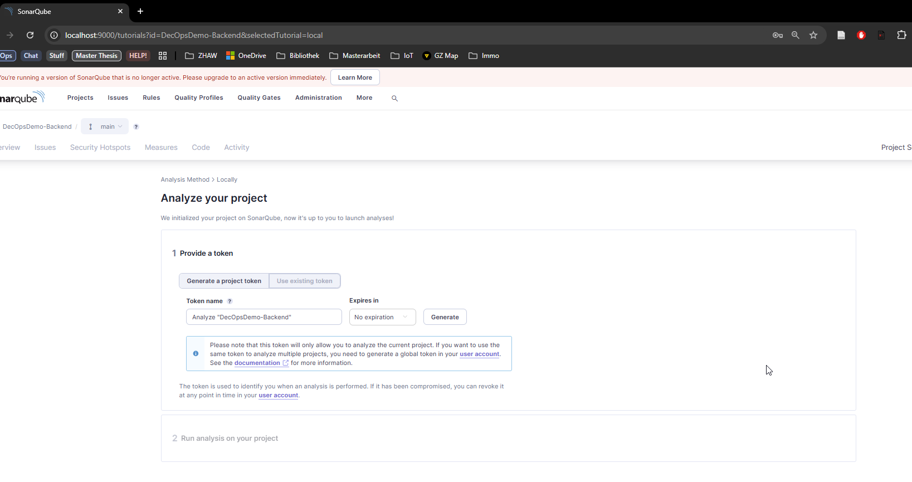

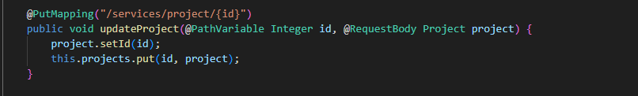

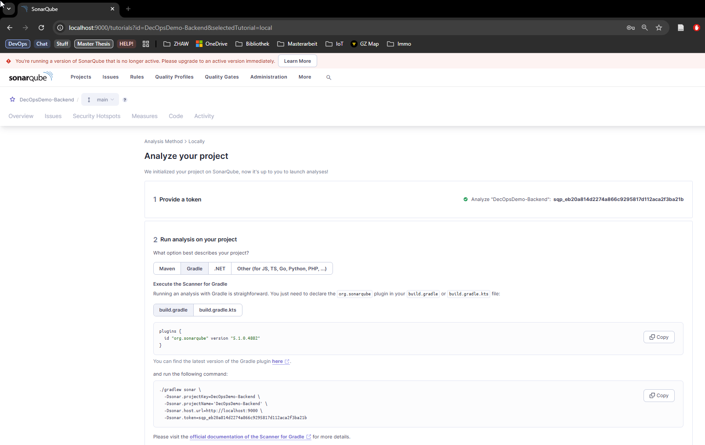

Durch die Erstellung des Keys kann nun Sonar verbunden werden.

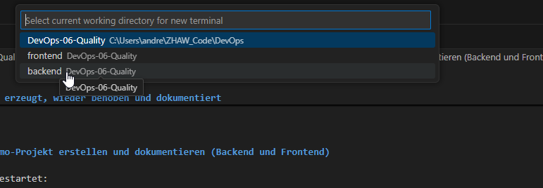

Und Sonar für das Backend läuft nun einwandfrei:

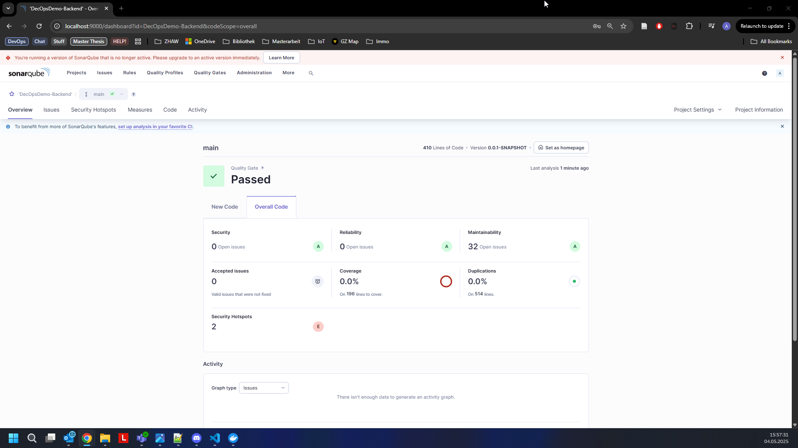

Die gleichen Schritte in Sonar und VS Code werden nun fürs Frontend wiederholt.

Wir bekommen wieder einen Key, um das Sonar mit dem Frontend-Code zu verbinden und tragen dies im VSCode ein:

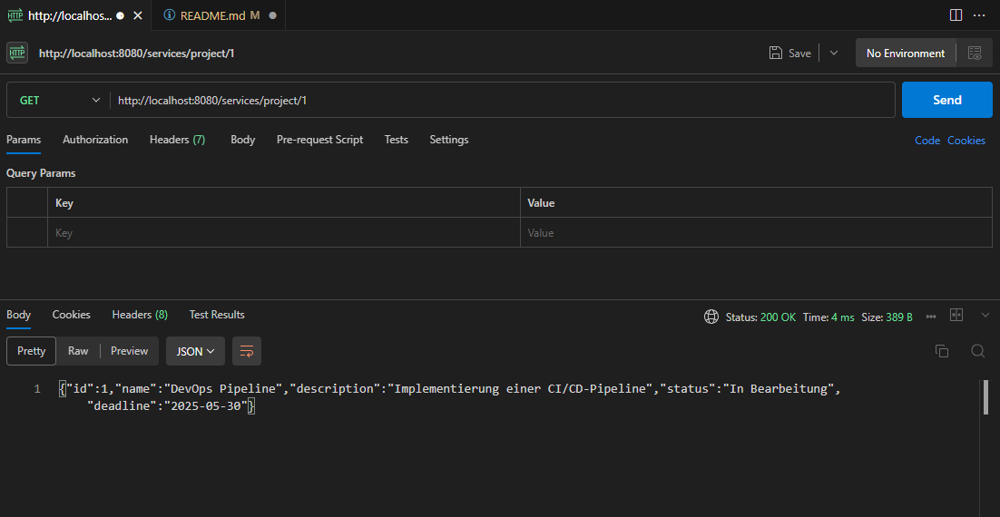

Achtung anderer command nötig für Frontend:

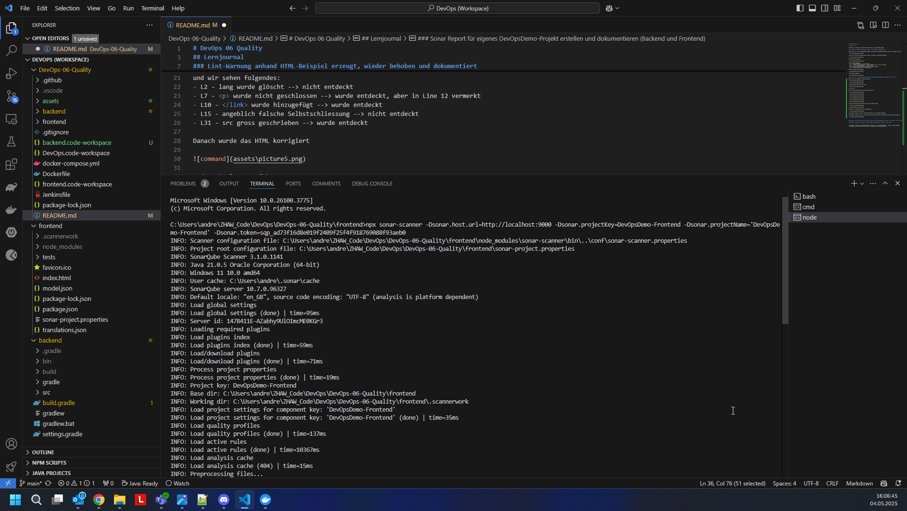

Nach der 4 Minütigen Execution ist dann Sonar bereit beide FrontEnd und Backend Reports zu zeigen

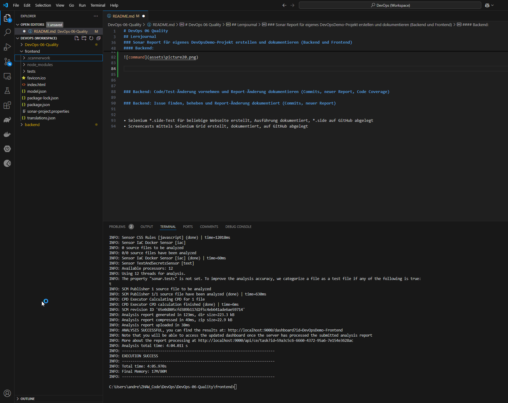

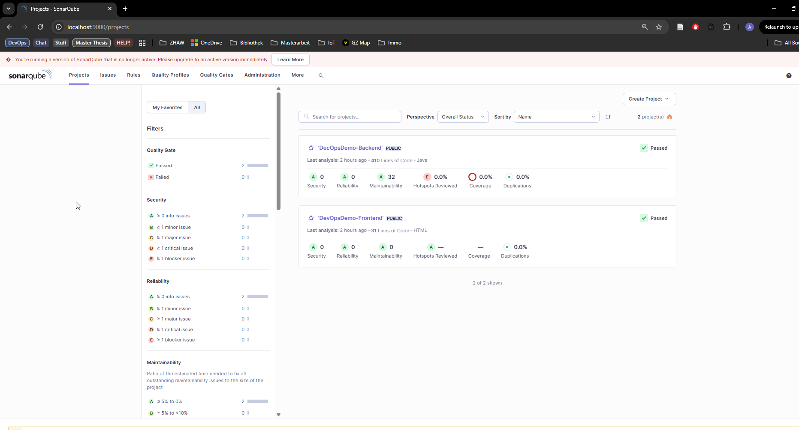

### Backend: Code/Test-Änderung vornehmen und Report-Änderung dokumentieren (Commits, neuer Report, Code Coverage)
Nun werden gewisse Teile des DevOpsDemo-Backend gemacht, damit Sonar bessere Zahlen liefert:

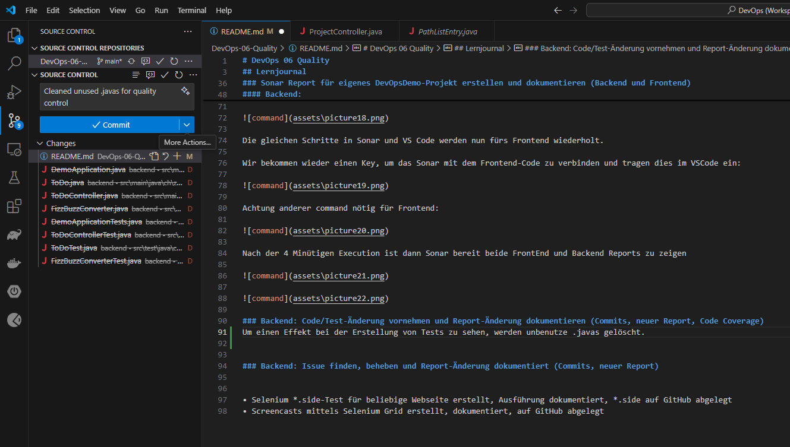

Einerseits sollte die Test coverage erhöht werden. Zurzeit ist diese bei 0%

Changes wurden

### Backend: Issue finden, beheben und Report-Änderung dokumentiert (Commits, neuer Report)

• Selenium *.side-Test für beliebige Webseite erstellt, Ausführung dokumentiert, *.side auf GitHub abgelegt
• Screencasts mittels Selenium Grid erstellt, dokumentiert, auf GitHub abgelegt