# DevOps 06 Quality

## Lernjournal

Um Woche 6 zu erledigen, wurde der Stand von Woche 3 in dieses Repo kopiert.

### Lint-Warnung anhand HTML-Beispiel erzeugt, wieder behoben und dokumentiert

Fehler wurden für die Lint-Behandlung ergänzt. Die Vermerke im abgebildeten HTML zeigt, was verändert wurde und hoffentlich durch Lint erkennt wird:

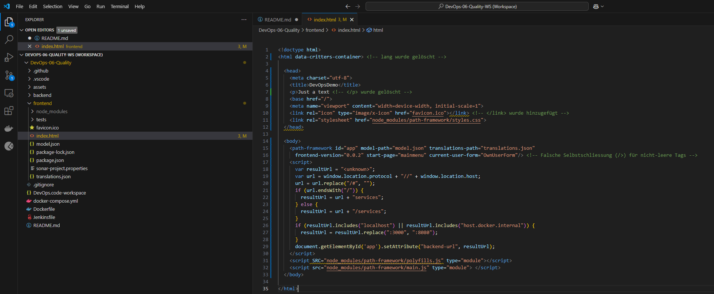

Um nun Lint starten zu können wurde der Folder "frontend" als Workspace geöffnet

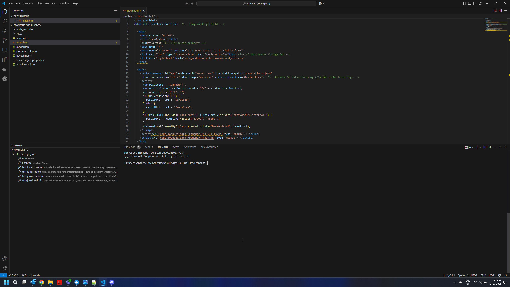

und Lint laufen gelassen:

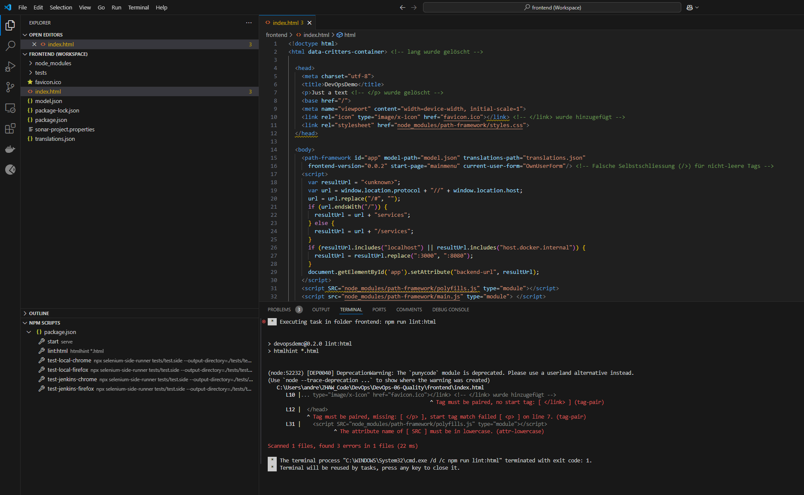

und wir sehen folgendes:
- L2 - lang wurde glöscht --> nicht entdeckt
- L7 - 
 wurde nicht geschlossen --> wurde entdeckt, aber in Line 12 vermerkt
- L10 - </link> wurde hinzugefügt --> wurde entdeckt
- L15 - angeblich falsche Selbstschliessung --> nicht entdeckt
- L31 - src gross geschrieben --> wurde entdeckt

Danach wurde das HTML korrigiert

und nochmals ausgeführt:

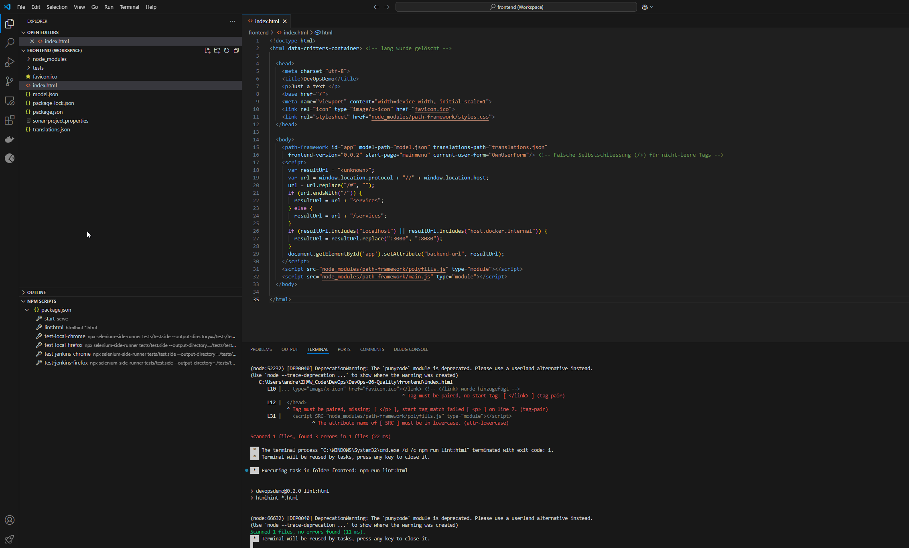

### Sonar Report für eigenes DevOpsDemo-Projekt erstellen und dokumentieren (Backend und Frontend)

Zuerst wird mal SonarQube in Docker gestartet:

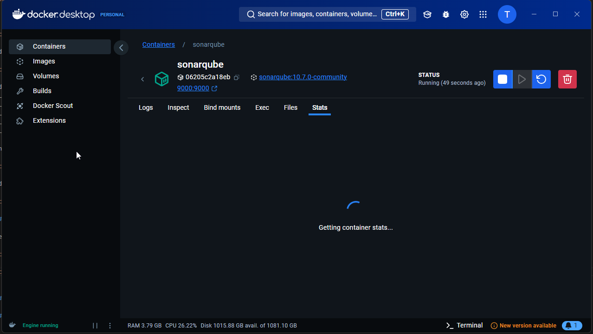

und SonarQube im Browser ersichtlich:

#### Backend:

Nun wird das Backend erstellt mittels local Project:

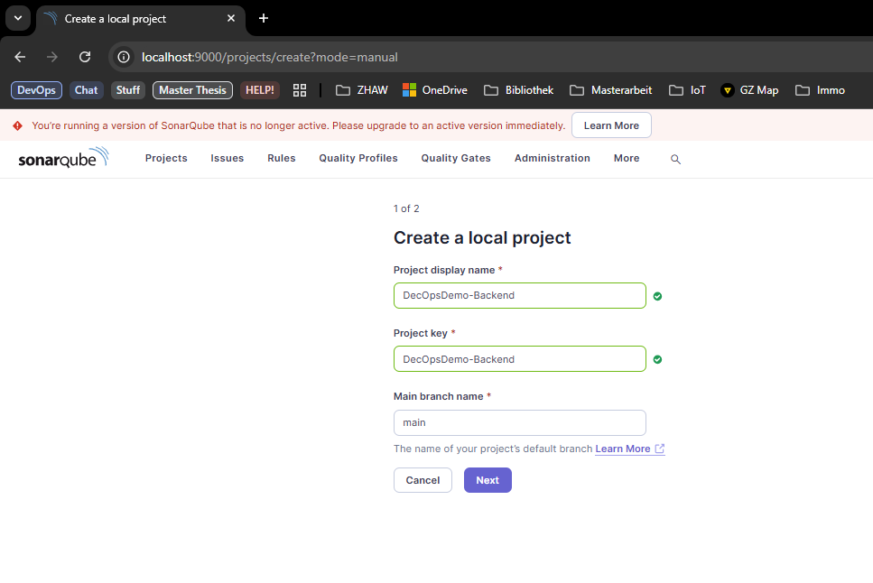

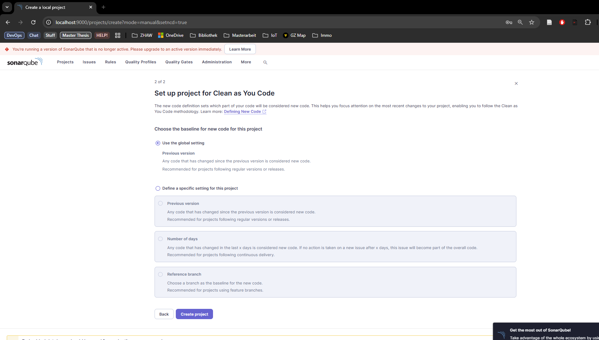

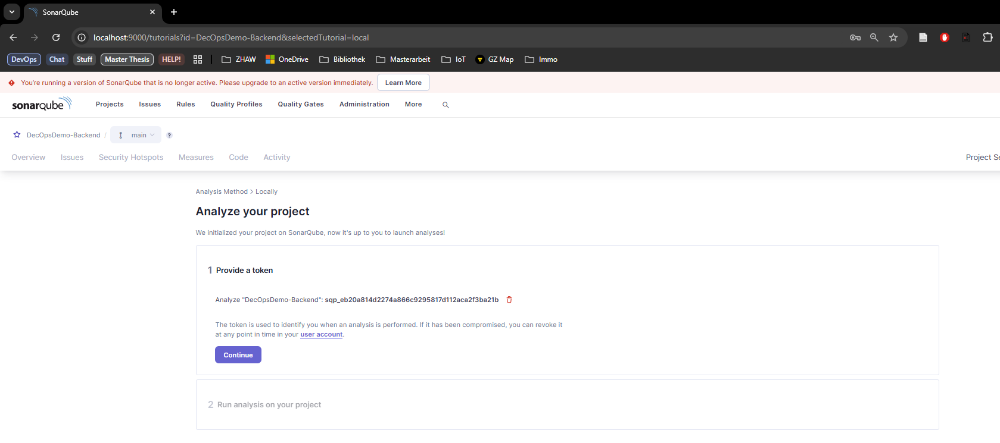

Durch die Erstellung des Keys kann nun Sonar verbunden werden.

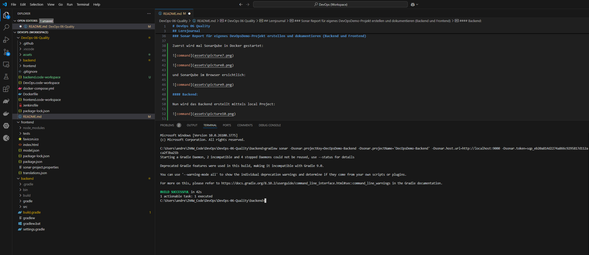

Und Sonar für das Backend läuft nun einwandfrei:

#### Frontend:

Die gleichen Schritte in Sonar und VS Code werden nun fürs Frontend wiederholt.

Wir bekommen wieder einen Key, um das Sonar mit dem Frontend-Code zu verbinden und tragen dies im VSCode ein:

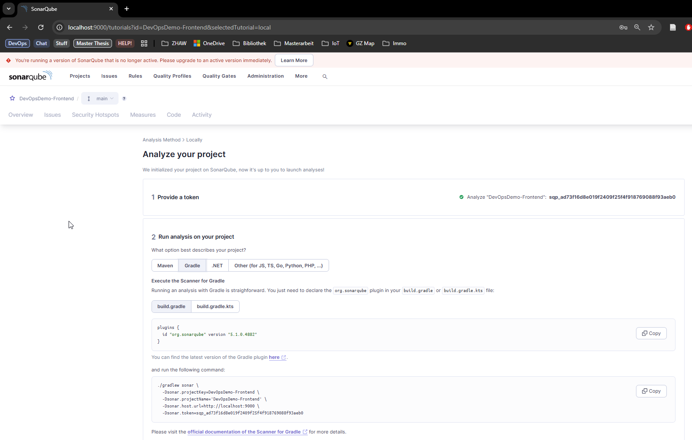

Achtung anderer command nötig für Frontend:

Nach der 4 Minütigen Execution ist dann Sonar bereit beide FrontEnd und Backend Reports zu zeigen

### Backend: Code/Test-Änderung vornehmen und Report-Änderung dokumentieren (Commits, neuer Report, Code Coverage)
Nun werden gewisse Teile des DevOpsDemo-Backend gemacht, damit Sonar bessere Zahlen liefert:

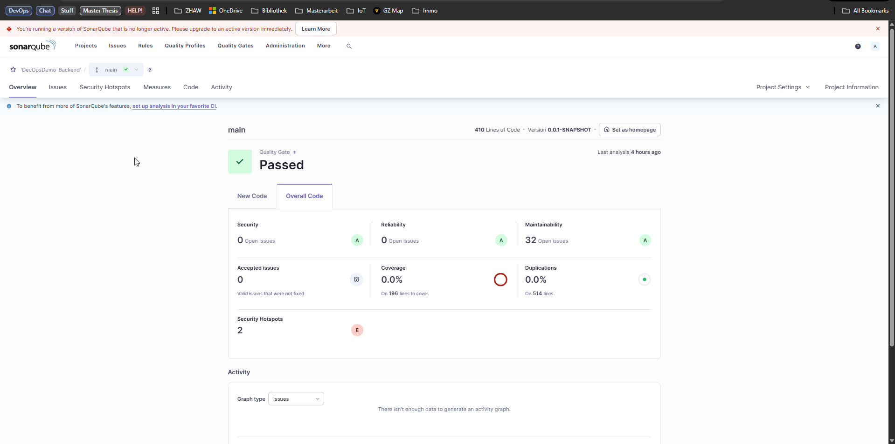

Einerseits sollte die Test coverage erhöht werden. Zurzeit ist diese bei 0%

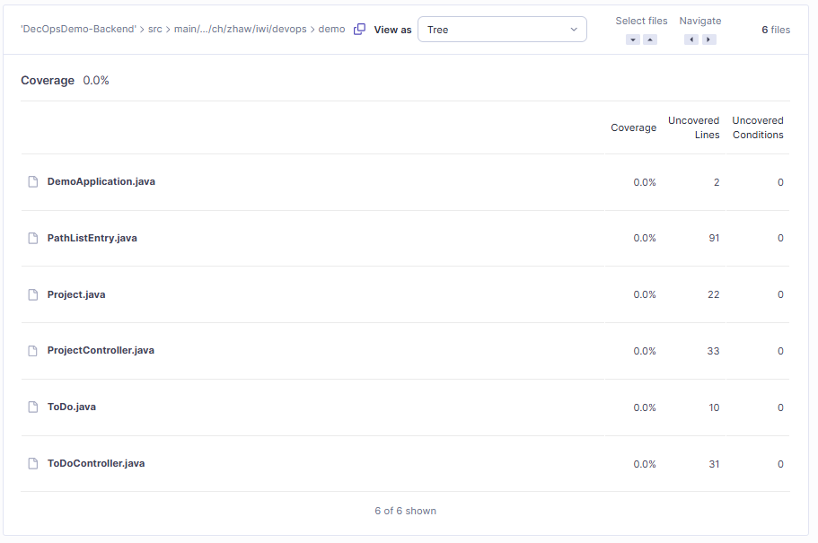

Changes Dabei wurde lediglich das DemoAppTest ergänzt und nun ist die Coverage auf 87.7%:

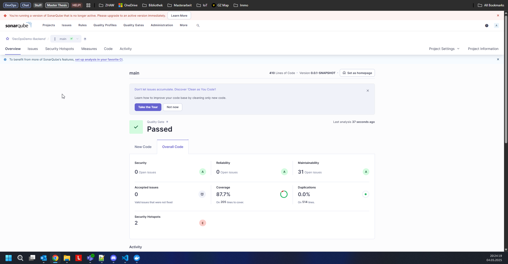

Wie in der Abbildung zu beginn dieses Kapitels, waren ebenfalls 32 Maintainability Issues im Report. Nach dem Fix wurden rund 26 gezählt.

### Backend: Issue finden, beheben und Report-Änderung dokumentiert (Commits, neuer Report)
Hier wurden nun SeleniumTests erstellt für das DevOpsDemo.
Insgesamt wurden drei Tests erstellt:
- Login DevOpsDemo: Testet das Login und stellt anhand eines Elements fest, ob der Zugriff geklappt hat (Siehe erster Screenshot). Ablauf:
    - Öffnen der Seite
    - Anpassen der Fenstergrösse
    - Click auf das usernameField und eingabe des Usernames "Selenium"
    - Click auf das passwordField und eingabe des Usernames "Selenium"
    - Click auf den signinButton
    - Prüfen anhand eines Elements, ob das LogIn successful war
- Add NewBoard: Hier wird ein neues Board hinzugefügt und geschaut, ob man sich im Anschluss in diesem Board befindet (Siehe zweiter Screenshot). Ablauf:
    - Öffnen der Seite
    - Anpassen der Fenstergrösse
    - Click auf den Button AddField
    - Click in das Feld newBoardTitle
    - Hinzufpgen des Namens "Test"
    - auf Erstellen drücken.
    - Anhand eines Elements schauen, ob man auf das neu erstellte Board weitergeleitet wurde
- Und danach wird getestet, ob das LogOut funktioniert (Siehe dritter Screenshot). Ablauf:
    - Öffnen der Seite
    - Anpassen der Fenstergrösse
    - Clicken auf das profileIcon
    - Clicken auf "LogOut"
    - Anhand eines Elements schauen, ob man auf der LogInSeite ist

In der Test Suite wurden die Testfälle so angelegt, dass eine Ausführung aller Tests auf einmal möglich sind und somit dies ohne grossen Aufwand gemacht werden kann.

Für SeleniumGrid wurde nun das DockerFile so angepasst, dass das DevOpsDemo von Woche 4 gestartet werden kann und die gleichen Tests ausgeführt werden wie oben:

Das Selenium Grid zeigt momentan folgendes:

